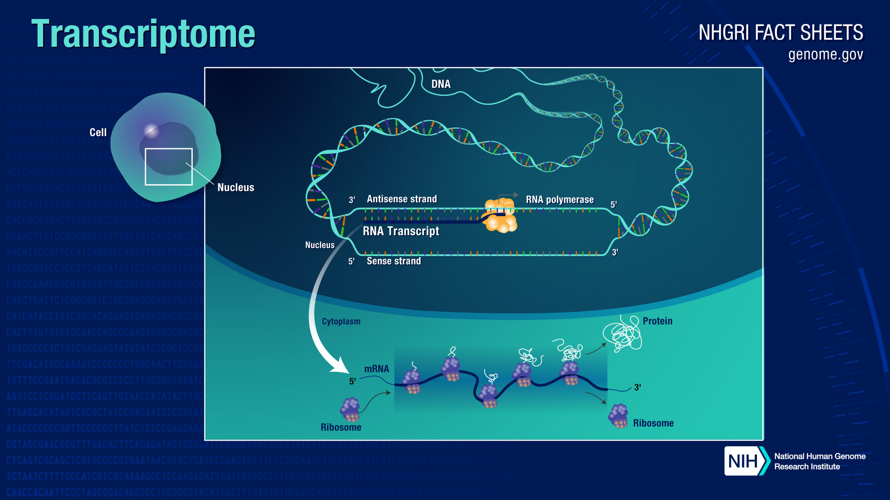

Introduction to RNA-Seq
============================================

**RNA sequencing (RNA-Seq)** has revolutionized the study of gene expression. The human genome is comprised of DNA (deoxyribonucleic acid) that must be converted into RNA (ribonucleic acid) through a process called transcription in order to generate proteins through another process called translation. Collectively, the transcripts comprise the transcriptome and represent a collection of all the gene readouts present in a cell. RNA-Seq is a highly senstitive assay that determines the sequences of the RNA transcripts so that each one can be counted to measure the expression of each gene across the transcriptome. This can provide insight into changes occurring in disease states, in response to therapies, under different environmental conditions, and many other study designs. Additionally, RNA-Seq data enables researchers to identify transcript isoforms, gene fusions, single nucleotide polymorphisms, and other features.

**Library Preparation** is the laboratory technique used to create high quality sequence-ready RNA. The first step of generating RNA-Seq data is to isolate the RNA from samples of tissue, bone, blood, tumor, etc using special laboratory kits. Once isolation is complted the quality of the total RNA must be assessed using a Bioanalyzer or a similar instrument in order to ensure the RNA is intact and of sufficient concentration for library preparation. Next the RNA will be used as an input to molecular kits that convert total RNA into a libary of template moclecules of known strand origin. The resulting mRNA is then fragmented and reverse transcribed using random primers. The cDNA product is then amplified, incorporating sequencing adapters and barcodes to create a final double-stranded cDNA library ready for sequencing.

<iframe width="1080" height="400" src="https://www.youtube.com/embed/M7K801nQZcg?si=VmEKytZqvj6SuyCq" frameborder="0"></iframe>