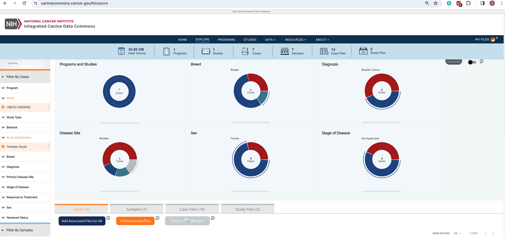
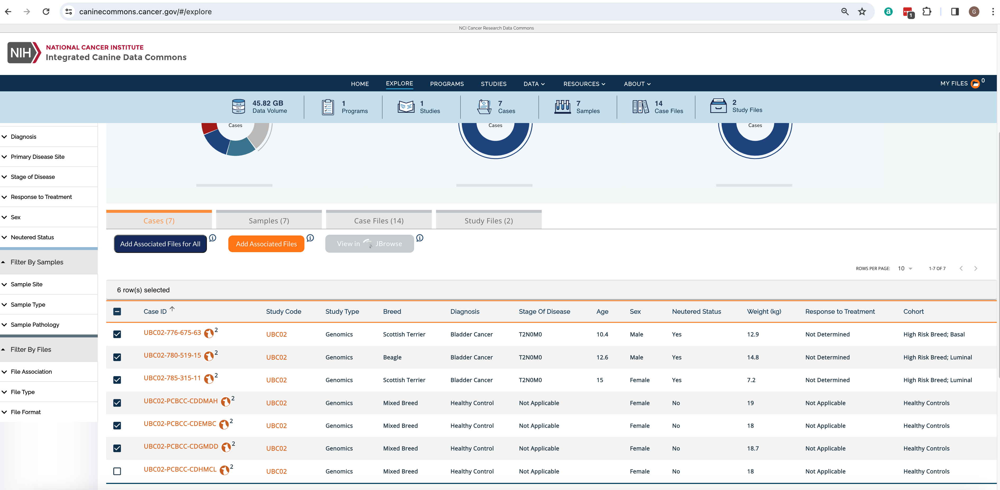
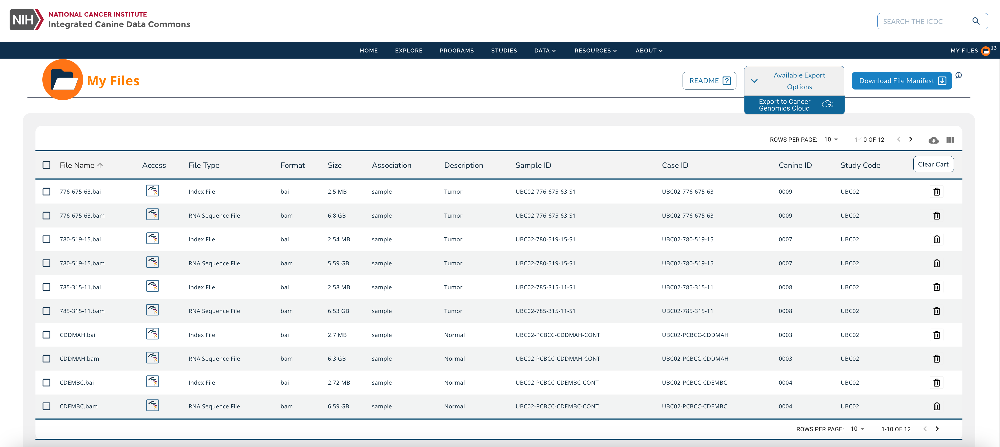

Building a Cohort within the ICDC
============================================

The [Integrated Canine Data Commons](https:https://caninecommons.cancer.gov/#/) is a cloud-based repository of spontaneously-arising canine cancer data from pet dogs established to further research on human cancers by enabling comparative analysis with canine cancer.
All files available through the ICDC are open-access and can be exported into the CGC by any user. For this tutorial, we will conduct an example RNA-Seq analysis using 6 Binary Alignment Mapping files derived from 6 canine individuals enrolled in the UBC02 study.  3 files are from tumor tissues sequenced from diseased individuals and 3 files are from normal tissues sequenced from healthy individuals. 

## Step 1: Filter cases using faceted search
* Navigate to the [ICDC Explore Dashboard](https://caninecommons-qa.cancer.gov/#/explore)
* Expand the Study facet and select UBC02
* Expand the Study Participation facet and select Multiple Study

## Step 2: Add files to the Cart
* From within the Dashboard table select 3 healthy controls and 3 diseased canines
* Click on the Add Associated Files button
* Click on the My Files icon in the top right of the navigation bar

## Step 3: Export files to the Cancer Genomics Cloud
* Check to make sure there are 12 files in the cart
* Expand the dropdown menu of the Available Export Options button
* Click on Export to Cancer Genomics Cloud
* Follow the prompt to login to the CGC or create an account if one does not yet exist
* Select a Destination project from the dropdown menu or create a new project
* Select the checkbox to agree to the CGC terms
* Click on the Import data button

