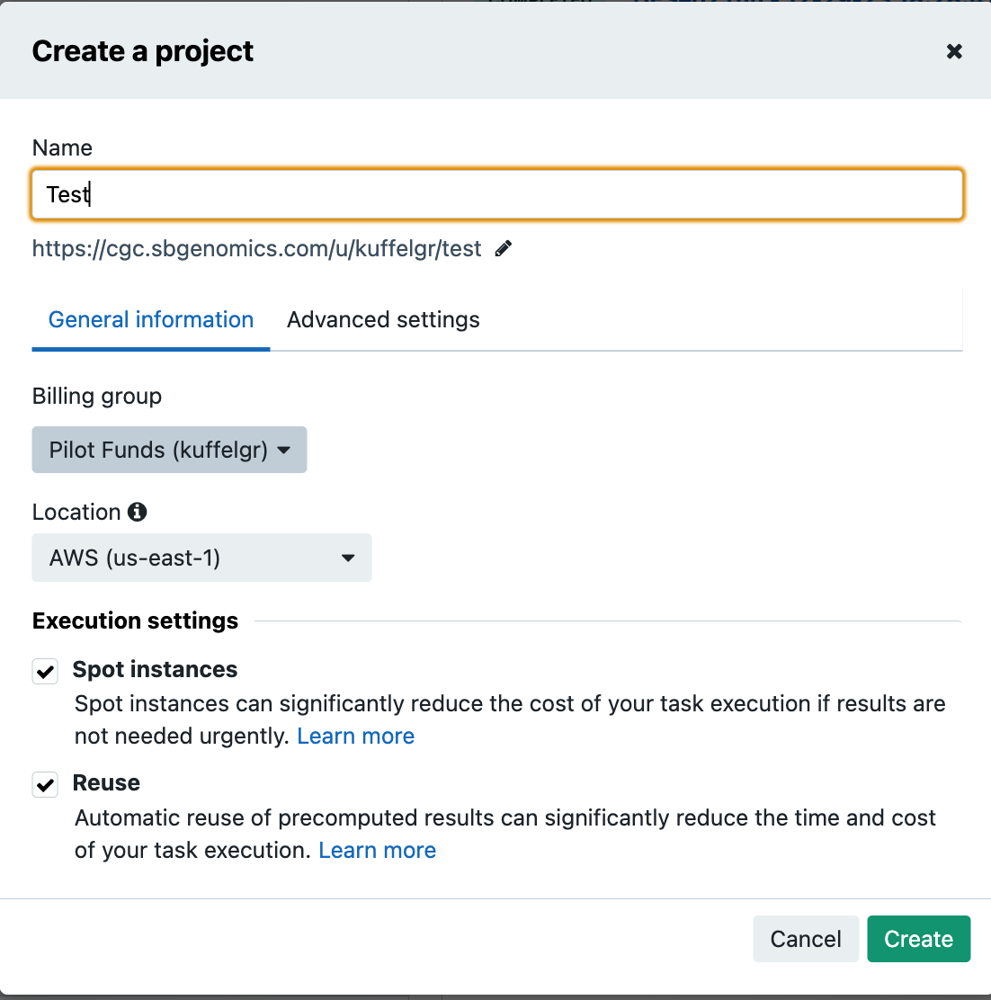
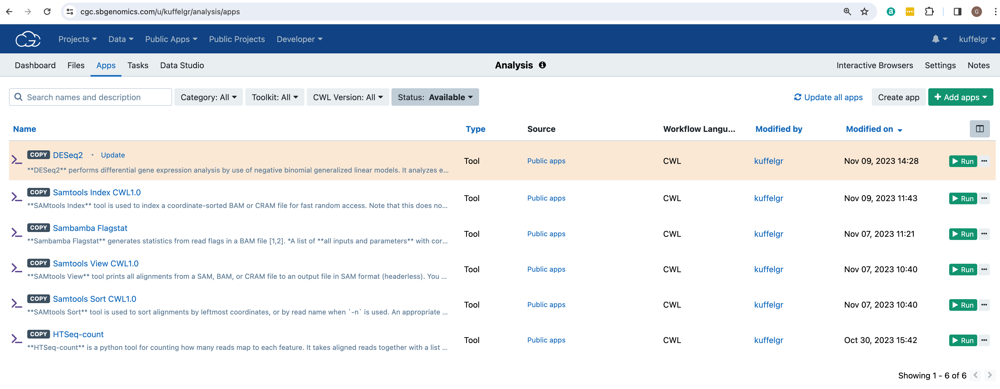

Navigating the Cancer Genomics Cloud (CGC)
============================================
The Seven Bridges Cancer Genomics Cloud (CGC) is powered by Velsera and funded by the National Cancer Institute. The CGC is a cloud-based technology that enables analysis, storage, and computation of large cancer datasets. The CGC interoperates with the ICDC and other data commons within the Cancer Research Data Commons (CRDC) making it easier than ever to move from data acquisition to data analysis.

!!! info
    Each new user to the CGC will be provided with $300 of pilot funding, courtesy of the NCI. 

## Step 0: Create a CGC project 
If this is the first time you are working within the CGC you will need to create a project to serve as a container to hold the files from the ICDC, the tools and apps from the CGC, and the generated analysis output files. 
* Click on Projects from the top navigation bar to expand the dropdown menu
* Click on the Create a project button at the bottom of the menu
* In the Create a project modal that opens, provide a name, select the appropriate Billing group and Location and ensure Spot instances and Reuse is checked under Execution settings. 

## Step 1: Add ICDC files to project
Add files to the newly created project using the Building a Cohort within the ICDC tutorial section

## Step 2: Inspect files in project

!!! info
    The CGC has over 900 public apps that can be easily copied into a project to enable reproducible bioinformatics. For this tutorial, we will copy several apps into our project.
## Step 3: Copy apps into project
* Click on Public Apps from the top navigation bar to expand the dropdown menu 
* Select Workflows and Tools
* Click the Browse apps button
* Use the search bar to find each tool listed below
    - Sambamba Flagstat
    - Samtools View
    - Samtools Sort
    - HTSeq-count
    - DESeq2

* For each tool, click the Copy button and then Select the appropriate project from the dropdown menu and then click the Copy button once more
* Click on Projects from the main navigation bar to expand the dropdown menu and select the appropriate project name to return to the project
* Click on Apps from the menu bar to ensure all tools were effectively copied into the project

