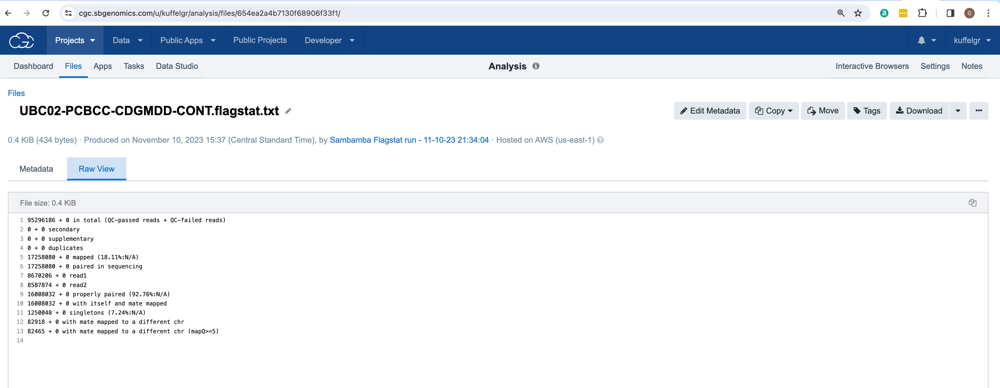

Analysis within the Cancer Genomics Cloud (CGC)
============================================

## Step 1: Copy tools into project
* Click on Public Apps from the top navigation bar to expand the dropdown menu
* Select Workflows and Tools
* Click the Browse buttons app
* Use the search bar to find each tool listed below
** Sambamba Flagstat
** Samtools View
** Samtools Sort
** HTSeq-count
** DESeq2
* For each tool, click the Copy button and then Select the appropriate project from the dropdown menu and then click the Copy button once more
* Click on Projects from the main navigation bar to expand the dropdown menu and select the appropriate project name to return to the project
* Click on Apps from the secondary navigation bar to ensure all tools were effectively copied into the project

## Step 2: Inspect summary stats for each file with Sambamba Flagstat
* Click on Sambamba Flagstat
* Click on the Run button from the top right-hand side
* Click on the toggle to turn Batching On
* Select File from the Batch by dropdown menu
* Click on Input alignments
* Select all bam files by clicking on the respective checkboxes
* Click on the Save selection button on the top right-hand side
* Click on the Run button on the top right-hand side 

## Step 3: Inspect bam file headers with Samtools View
* Click on Apps from the secondary navigation menu 
* Click on Samtools View
* Click on the Run button from the top right-hand side
* Under App Settings scroll down to Output the header only and select True from the dropdown menu
* Click on the toggle to turn Batching On
* Select File from the Batch by dropdown menu 
* Click on Select file(s) dropdown menu associated with the Input BAM/SAM/CRAM file
* Select all bam files by clicking on the respective checkboxes
* Click on the Save selection button on the top right-hand side
* Click on the Run button on the top right-hand side 
## Step 4: Count sequencing reads with htseq-count
* Click on Apps from the secondary navigation menu 
* Click on HTSeq-count
* Click on the Run button from the top right-hand side
* Under App Settings select name from the Order dropdown menu
* Under App Settings select ignore from the secondary alignments dropdown menu
* Under App Settings select ignore from the supplementary alignments dropdown menu

## Step 5: Create a csv file with phenotype data for all samples for DESeq2
* Click on Files from the menu bar
* In the search box type .csv and hit enter
* Click on the file manifest which will be named with a series of letters and numbers with a .csv file extension
* Click on the Download button to initiate a download to your local machine

* Open this file in Excel or any similar application
* Move the sample_id column so that it is the first column in the file
* Delete all rows pertaining to the Index Files with a file_format of bai
* Save the file as phenotype_filtered.csv
* The file created should be formatted similar to the file shown below

## Step 6: Conduct differential expression with DESeq2