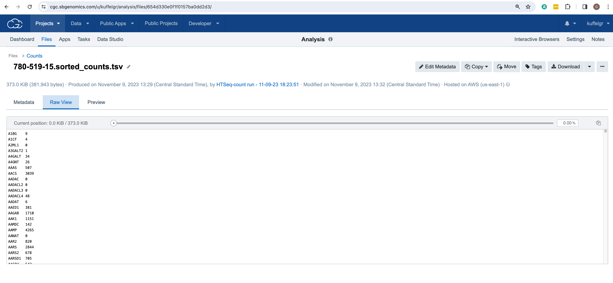
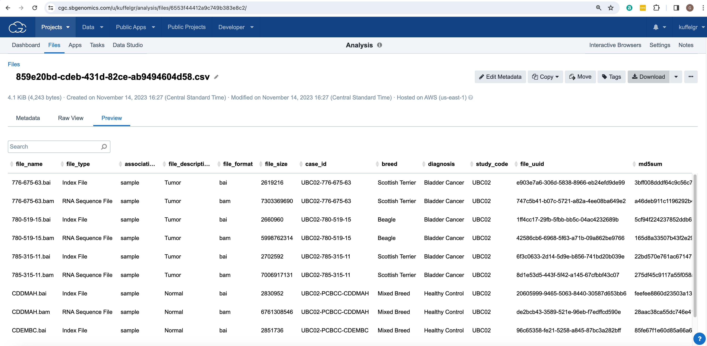
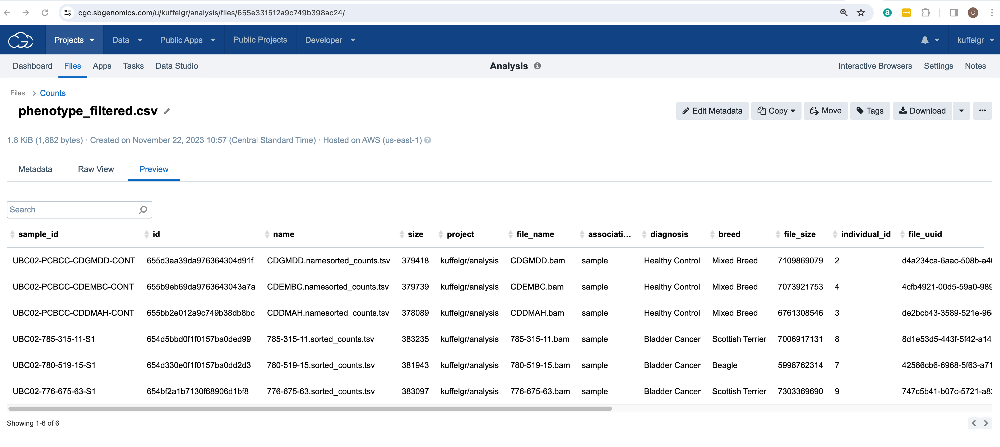
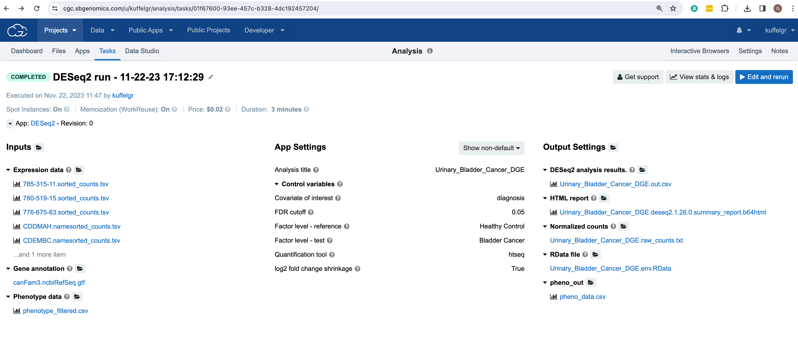
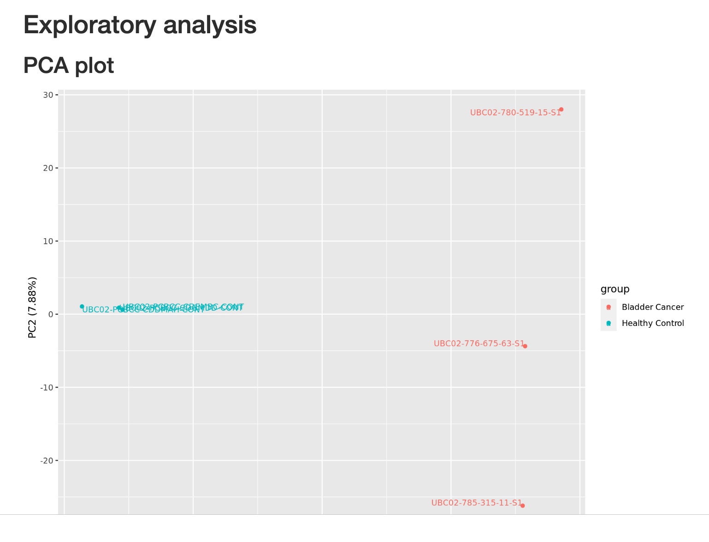
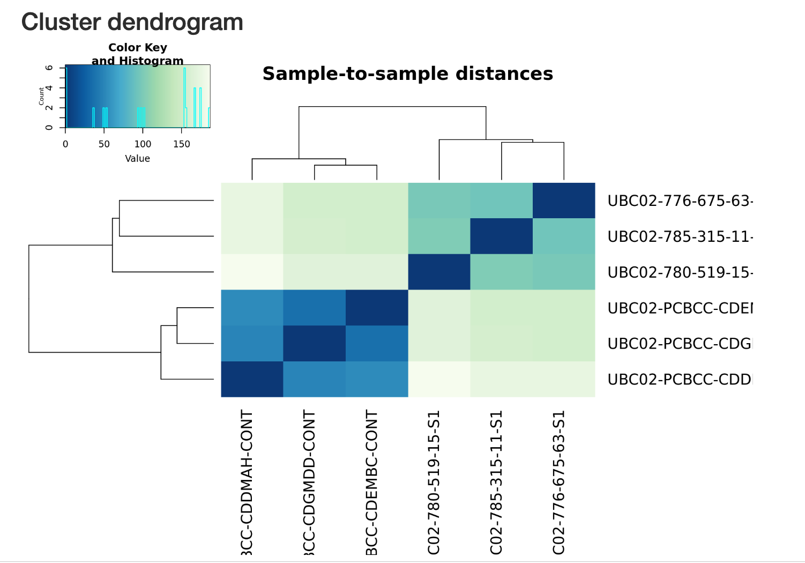
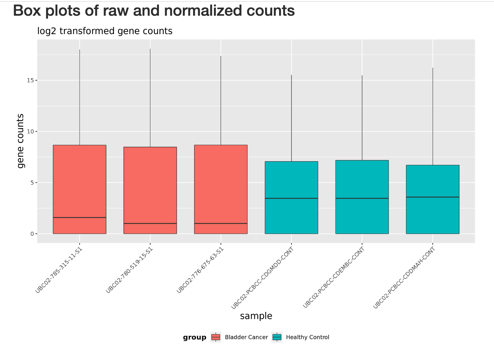
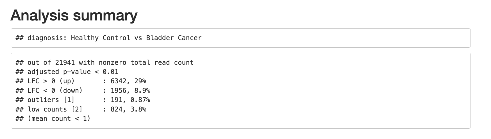

Analysis within the Cancer Genomics Cloud (CGC)
============================================

## Step 1: Copy tools into project
* Click on Public Apps from the top navigation bar to expand the dropdown menu
* Select Workflows and Tools
* Click the Browse apps button
* Use the search bar to find each tool listed below
    - Sambamba Flagstat
    - Samtools View
    - Samtools Sort
    - HTSeq-count
    - DESeq2

* For each tool, click the Copy button and then Select the appropriate project from the dropdown menu and then click the Copy button once more
* Click on Projects from the main navigation bar to expand the dropdown menu and select the appropriate project name to return to the project
* Click on Apps from the menu bar to ensure all tools were effectively copied into the project

## Step 2: Inspect summary stats for each file with Sambamba Flagstat
* Click on Sambamba Flagstat
* Click on the Run button from the top right-hand side
* Click on the toggle to turn Batching On
* Select File from the Batch by dropdown menu
* Click on Input alignments
* Select all bam files by clicking on the respective checkboxes
* Click on the Save Selection button on the top right-hand side
* Click on the Run button on the top right-hand side 

## Step 3: Inspect bam file headers with Samtools View
* Click on Apps from the menu bar
* Click on Samtools View
* Click on the Run button from the top right-hand side
* Under App Settings scroll down to Output the header only and select True from the dropdown menu
* Click on the toggle to turn Batching On
* Select File from the Batch by dropdown menu 
* Click on Select file(s) dropdown menu associated with the Input BAM/SAM/CRAM file
* Select all bam files by clicking on the respective checkboxes
* Click on the Save selection button on the top right-hand side
* Click on the Run button on the top right-hand side

## Step 5: Load the appropriate reference annotation file
In order to count gene features across exons the HTSeq-count tool will need a Gene Transfer Format (GTF) file that contains information about each gene from a particular reference genome. In this case, the original BAM files were mapped to the NCBI reference genome canFam3. 
* Download the GTF file located here https://hgdownload.soe.ucsc.edu/goldenPath/canFam3/bigZips/genes/
* Click on canFam3.ncbiRefSeq.gtf.gz
* Locate this file on your local computer and open to unzip
* Navigate back to the CGC and add this file to the project
## Step 4: Count sequencing reads with htseq-count
* Click on Apps from the secondary menu bar
* Click HTSeq-count
* Click on the Run button from the top right-hand side
* Under App Settings select name from the Order dropdown menu
* Under App Settings select ignore from the secondary alignments dropdown menu
* Under App Settings select ignore from the supplementary alignments dropdown menu
* Click on the toggle to turn Batching On
* Select File from the Batch by dropdown menu 
* Click on the Select file(s) button associated with Aligned reads
* Select all name sorted bam files from the name_sorted folder
* Click on the Select file(s) button associated with Reference annotation file
* Select canFam3.ncbiRefSeq.gtf.gz

## Step 5: Create a csv file with phenotype data for all samples for DESeq2
* Click on Files from the menu bar
* In the search box type .csv and hit enter
* Click on the file manifest which will be named with a series of letters and numbers with a .csv file extension
* Click on the Download button to initiate a download to your local machine

* Open this file in Excel or any similar application
* Move the sample_id column so that it is the first column in the file
* Delete all rows pertaining to the Index Files with a file_format of bai
* Save the file as phenotype_filtered.csv
* The file created should be formatted similar to the file shown below

* Click on the Add files button to expand the dropdown menu and select Your Computer
* Click on the Browse files button to add the file created named phenotype_filtered.csv
* Click on the green Start upload button

## Step 6: Conduct differential expression with DESeq2
* Click on Apps from the menu bar
* Click DESeq2 
* Click on the Run button from the top right-hand side
* Under App Settings enter Urinary_Bladder_Cancer_DGE as the Analysis title
* Under App Settings enter diagnosis as the Covariate of interest
* Under App Settings enter 0.01 as the FDR cutoff
* Under App Settings enter Healthy Control as the Factor level - reference
* Under App Settings enter Bladder Cancer as the Factor level - test
* Under App Settings select htseq from the dropdown menu of Quantification tool
* Under App Settings select True from the dropdown menu of log2 fold change shrinkage
* Under Inputs click on the Select file(s) button associated with Expression data
    * Select the counts.tsv files from the Counts folder
* Under Inputs click on the Select file(s) button associated with Gene annotation
    * Select canFam3.ncbiRefSeq.gtf
* Under Inputs click on the Select file(s) button associated with Phenotype data
    * Select phenotype_filtered.csv

* Click on the Run button in the upper right-hand corner
* When the task has completed successfully inspect the results that should be the same as shown below

