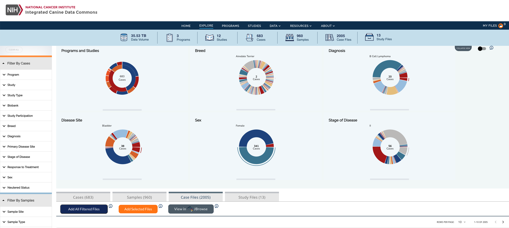
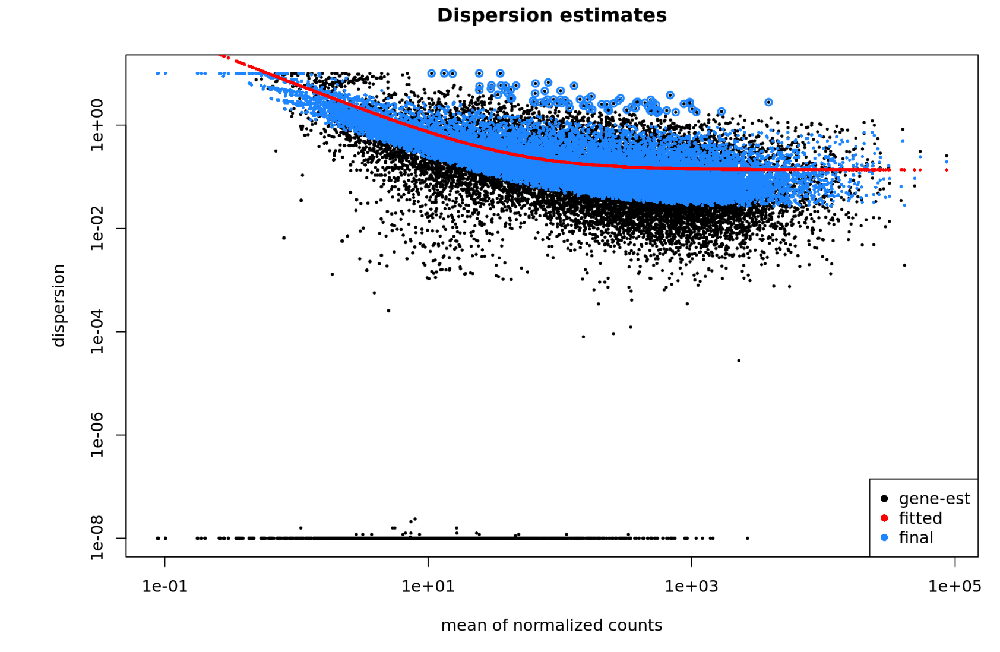

Welcome to the Canine Agility Training Center
========================================================

This website contains a library of tutorials for exploring data within the Integrated Canine Data Commons (ICDC) and conducting analysis using the connected cloud resource, the Cancer Genomics Cloud (CGC).

=== "Explore ICDC Data"

  
    
 

=== "Conduct Anaylysis in the CGC"

    

!!! note
    This is a collapsible note

    You can add a `+` character to force the box to be initially open `???+`

   